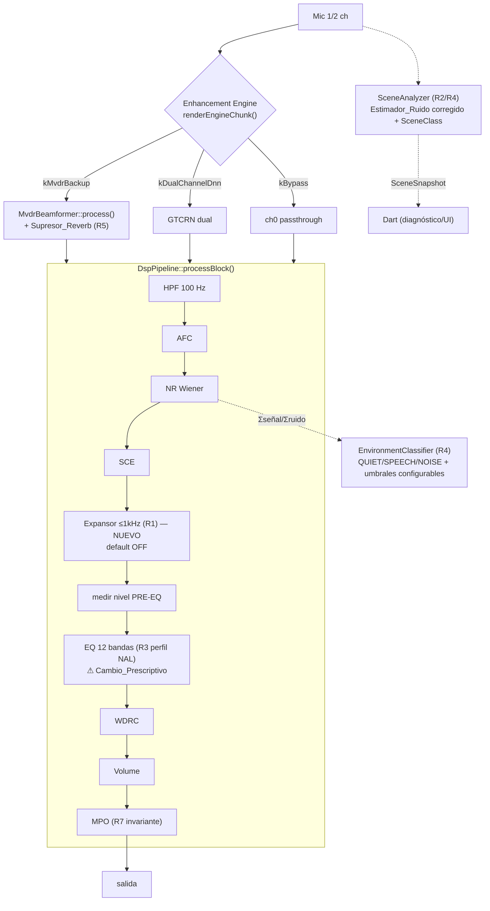

# Design Document — MVDR Noise & Clarity Tuning

> Autor: bioingeniero (rol del proyecto).
> Basado en `requirements.md` (7 requisitos EARS) y `research.md` (decisiones técnicas por requisito).
> Todo el diseño está anclado al código C++ real bajo
> `Repo Oir Pro2\Audifon\android\app\src\main\cpp\`. Los símbolos citados fueron
> verificados por lectura directa de los archivos; lo que se asume se marca como
> **[ASUNCIÓN]** y lo que no se pudo confirmar como **[NO VERIFICADO]**.

---

## Overview

Este diseño lleva el modo MVDR (2 micrófonos) a nivel producción corrigiendo cuatro
defectos medidos y afinando dos componentes ya existentes, sin romper los modos
`Bypass`, `DNN dual` ni `MVDR`. Cada mejora es toggleable e independiente, con
**defaults = comportamiento previo** (Requisito 6), y ninguna se coloca después del
limitador MPO (Requisito 7).

Alcance por requisito:

- **R1 (hiss/expansión)**: nuevo **Expansor** de baja frecuencia (≤1000 Hz), header-only,
  insertado en `DspPipeline` antes del EQ. Downward expansion bajo un knee configurable.
- **R2 (estimador de ruido/SNR)**: corrección del **bug de escala** en el path de
  `SceneAnalyzer` (`scene_analyzer.cpp` + `noise_profile`) que produce piso −77…−97 dB y
  SNR pegado en 40 dB; luego, opción de estimador MMSE-SPP detrás de toggle.
- **R3 (perfil EQ → NAL)**: **Cambio_Prescriptivo** — reperfilado de las 12 ganancias del
  EQ. NO se implementa sin confirmación explícita del usuario; impacta al paciente que
  clona el C++.
- **R4 (clasificador de escena)**: convergencia del clasificador una vez corregido R2, con
  umbrales configurables.
- **R5 (Supresor_Reverb)**: exponer parámetros/toggle del dereverb ya implementado en
  `mvdr_beamformer.h`.
- **R6 / R7**: toggles independientes con default seguro, cadena C++→Kotlin→Dart, y MPO
  como invariante de seguridad clínica.

---

## Estado del código verificado (anclaje)

Cadena de procesamiento real (leída en `dsp_pipeline.h`/`.cpp` y `audio_engine.cpp`):

```
mic (1 o 2 ch)
  └─ AudioEngine::renderEngineChunk()      // audio_engine.cpp
       ├─ kBypass         → ch0 passthrough
       ├─ kMvdrBackup     → MvdrBeamformer::process()  (mvdr_beamformer.h)  ← Supresor_Reverb aquí
       └─ kDualChannelDnn → dnnDenoiserDual_.processStereo()
  └─ DspPipeline::processBlock()           // dsp_pipeline.cpp
       HPF 100 Hz → AFC → NR (Wiener) → SCE → [medir nivel PRE-EQ]
       → EQ (12 bandas) → WDRC → Volume → MPO → salida
  └─ SceneAnalyzer::process()              // smart_scene/scene_analyzer.cpp (en paralelo)
       publica SceneSnapshot (SNR, piso ruido, VAD, features) para Dart y diagnóstico
```

Hechos verificados clave:

1. **Expansión**: vive en `WdrcProcessor` (`wdrc_processor.h`). `AtomicWdrcParams` tiene
   `expansionKnee{35.0f}` y `expansionRatio{2.0f}`. El WDRC es **broadband** (un solo
   `gainFactor` por bloque, aplicado a todo el buffer en `process()`), **sin selectividad
   de frecuencia**. → No puede limitar la expansión a ≤1000 Hz sin un componente nuevo.
   **[DISCREPANCIA]** `requirements.md`/`research.md` dicen "expansión desactivada
   (`expansionRatio=1.0`)", pero el código default es `2.0`. A verificar en Dart/on-device
   qué valor se envía realmente (ver R1).
2. **Estimador de ruido (R2)**: hay **dos** caminos de SNR:
   - `EnvironmentClassifier::estimateSnrFromNr()` (`environment_classifier.cpp`): SNR
     **autoconsistente** = `10·log10(Σseñal/Σruido)` sobre las bandas del NR Wiener. Es el
     que alimenta `envClassifier_.update()` en `dsp_pipeline.cpp:263-281`. **No** está roto.
   - `SceneAnalyzer` (`scene_analyzer.cpp:197-200`): `snrDb = inputDbSpl - noiseFloorDb`,
     con `inputDbSpl` calibrado a **dB SPL** (`rmsToDbSpl`, `splOffset≈93`) y `noiseFloorDb`
     de `NoiseProfile::getNoiseFloorDb()`, que promedia `noiseDb_[b]` derivado de
     `features.band_energy_db[b]` (magnitud FFT **sin calibrar**, `noise_profile.cpp` init a
     −90/−60). **Escalas distintas → resta inconsistente → SNR clamp a 40 y piso −77…−97.**
     Este es exactamente el "bug de escala" que `research.md` pide revisar primero.
3. **Clasificadores (R4)**: también hay dos:
   - `EnvironmentClassifier` (enum `QUIET/SPEECH/SPEECH_IN_NOISE/NOISE`) — **no** emite
     UNKNOWN. Converge con el SNR autoconsistente (ya funcional).
   - `SceneAnalyzer` → `SceneClass` (`scene_types.h`: `UNKNOWN..MUSIC`). El header dice
     **"FASE 1: la clasificación devuelve siempre `SceneClass::UNKNOWN`"** → **este** es el
     origen del "unknown 100%". Su decisión depende del `snr_db` roto de R2.
   **[NOTA]** El "unknown ≤20%" (R4 AC6) sólo tiene sentido sobre `SceneClass`. Se diseña
   sobre ese path. Confirmar con el usuario cuál etiqueta ve la UI antes de codificar.
4. **Supresor_Reverb (R5)**: en `mvdr_beamformer.h`, `dereverbEnabled_{true}` (default ON)
   y constantes `constexpr` **hardcodeadas dentro de `processFrame()`**: `kReverbDecay=0.80`,
   `kReverbOver=1.6`, `kReverbFloor=0.30`. No hay setters aún.
5. **MPO (R7)**: `MpoLimiter` (`mpo_limiter.h`) es la última etapa; peak-follower + hard-clamp
   `|y|≤thresholdLinear`. `DspPipeline` lo aplica al final. Invariante ya cumplido.
6. **Cadena Kotlin**: `NativeAudioBridge.kt` declara `external fun native*`; hoy expone EQ,
   volumen, WDRC (`nativeSetWdrcParams(expKnee,expRatio,compKnee,compRatio,attack,release)`),
   NR, MPO, escena (`nativeGetSceneSnapshot`), beamforming, motor. `CMakeLists.txt` lista los
   `.cpp`; los módulos **header-only** (`mvdr_beamformer.h`, `feedback_suppressor.h`,
   `transient_reducer.h`) NO figuran en `add_library` → no requieren tocar CMake.

---

## Architecture

### Puntos de inserción de cada componente



Decisiones arquitectónicas:

- El **Expansor (R1)** se inserta **antes del EQ** y **antes de medir el nivel PRE-EQ** (o
  justo después de NR), porque la expansión debe actuar sobre el nivel de entrada real, no
  sobre la señal amplificada. Es un módulo **header-only nuevo** (`expander.h`), siguiendo el
  patrón de `transient_reducer.h`/`feedback_suppressor.h` → **sin cambios en `CMakeLists.txt`**.
- El **Estimador_Ruido corregido (R2)** se mantiene en el path del `SceneAnalyzer`
  (`scene_analyzer.cpp` + `noise_profile.{h,cpp}`), corrigiendo la escala. El estimador
  MMSE-SPP opcional se implementa header-only para no tocar CMake.
- El **perfil EQ (R3)** NO cambia el algoritmo de `equalizer.cpp`; cambia el **vector de 12
  ganancias** que Dart calcula y envía por `setEqGains`. Es un **Cambio_Prescriptivo**.
- Los **umbrales del clasificador (R4)** pasan de `constexpr` a parámetros con setters
  atómicos en `environment_classifier.{h,cpp}`.
- El **Supresor_Reverb (R5)** expone toggle + parámetros ya existentes en `mvdr_beamformer.h`.

---

## Components and Interfaces

### R1 — Expansor de baja frecuencia (≤1000 Hz)

- **Archivo nuevo (header-only):** `cpp/expander.h` (patrón `transient_reducer.h`).
- **Inserción:** miembro `Expander expander_;` en `DspPipeline` (`dsp_pipeline.h`),
  llamado en `processBlock()` **después de NR/SCE y antes de `measureRmsDb`/EQ**.
- **Algoritmo:** split de banda con LPF ~1000 Hz (2º orden, coeficientes como el HPF ya
  presente en `dsp_pipeline`), downward expansion sobre la banda baja, recombinación con la
  banda alta intacta (preserva consonantes, `research.md` R1). Envelope con attack/release
  asimétricos independientes.
- **Firma propuesta:**
  ```cpp
  class Expander {
  public:
      void  init(int sampleRate);
      void  process(float* buffer, int blockSize, float inputLevelDb);
      void  setEnabled(bool e);          // toggle (AC5) — default OFF
      bool  isEnabled() const;
      void  setKneeDbSpl(float knee);    // AC1  default 45 dB SPL
      void  setRatio(float ratio);       // AC4  default 1.0 (=passthrough, AC3/AC7)
      void  setCutoffHz(float hz);       // AC2  default 1000 Hz
      void  setAttackMs(float ms);       // AC6  default ≤50 ms
      void  setReleaseMs(float ms);      // AC4a default ~300–500 ms
  };
  ```
- **Defaults seguros:** `enabled=false`, `ratio=1.0` → salida idéntica a la actual (R6.3).
- **Traza C++→Kotlin→Dart:**
  - C++: `native_bridge.cpp` → `nativeSetExpander(enabled, kneeDbSpl, ratio, cutoffHz, attackMs, releaseMs)` → `AudioEngine::setExpanderParams()` → `pipeline_` setters.
  - Kotlin: `NativeAudioBridge.kt` → `external fun nativeSetExpander(...)` + wrapper `fun setExpander(...)`.
  - Dart: nuevo método en `AudioMethodChannel.kt`/MethodChannel + control en la app del técnico.

### R2 — Estimador de piso de ruido y SNR realista

- **Archivos:** `smart_scene/scene_analyzer.cpp` (líneas ~194-200: `noiseFloorDb`, `snrDb`),
  `smart_scene/noise_profile.{h,cpp}` (`getNoiseFloorDb`, `update`, init −90/−60).
- **Fix primario (escala) — hacer PRIMERO (research.md):** poner `noiseFloorDb` en la MISMA
  referencia que `inputDbSpl`. Dos opciones:
  1. Derivar el piso del **mismo RMS/dBFS calibrado** (aplicar `splOffset` al piso, o computar
     `NoiseProfile` sobre energía calibrada a dB SPL), de modo que `snrDb = inputDbSpl −
     noiseFloorDb` sea físicamente coherente y el piso caiga en **[−60, −40] dBFS** (AC2, AC8).
  2. Reemplazar `snr_db` del snapshot por el SNR autoconsistente ya correcto
     (`estimateSnrFromNr`) para unificar ambos paths.
- **Fix secundario (opcional, toggle):** estimador **MMSE-SPP (Gerkmann-Hendriks 2012)** o
  **Minimum Statistics (Martin 2001)** header-only, detrás de un toggle; fallback al actual si
  resulta inestable (research.md R2).
- **Sin clamp fijo en 40 dB** salvo tope físico (AC3, AC4).
- **Observabilidad (AC7):** `SceneSnapshot.noise_floor_db_spl` y `snr_db` ya se serializan a
  Dart vía `nativeGetSceneSnapshot()` — no requiere nuevo canal, sólo corregir los valores.
- **Traza:** C++ (`scene_analyzer.cpp`) → `native_bridge.cpp::nativeGetSceneSnapshot` (ya
  existe) → Kotlin `nativeGetSceneSnapshot()` (ya existe) → Dart `SceneSnapshot.fromBytes`.

### R3 — Reperfilado espectral del EQ → NAL-NL2/NL3  ⚠ **Cambio_Prescriptivo**

> **NO se implementa sin confirmación explícita del usuario.** Altera la ganancia/perfil
> aplicado al paciente y se propaga al clon del paciente. Ver sección "Cambio_Prescriptivo".

- **Archivos:** el algoritmo NO cambia (`equalizer.cpp`/`equalizer.h`, bandas fijas
  `kEqFrequencies` = 250,500,750,1000,1500,2000,2500,3000,3500,4000,6000,8000 Hz). Cambia el
  **vector de 12 ganancias** que Dart genera:
  `hearing_aid_app/lib/domain/audiogram_driven_presets/bundle_builder.dart` y
  `audiogram_driven_bundle.dart`.
- **Objetivo (research.md R3):** ganancia relativa 2–4 kHz **>** 500–750 Hz (AC2); recortar el
  pico de +31 dB en 500–750 Hz al objetivo NAL (AC3); reducir la atenuación de −16 dB en
  8–10 kHz (AC4). Banda de EQ más alta = 8000 Hz (no hay banda 10 kHz; AC4 se cubre en 6–8 kHz).
- **Exposición del perfil (AC6):** hoy sólo se expone `eqMaxGain` (`getStageMetrics`). Para
  mostrar el perfil aplicado se propone **añadir `getEqGains()`** en `equalizer.h`/pipeline y un
  `nativeGetEqGains()` → Kotlin → Dart. **[OPCIONAL]** confirmar si la UI ya reconstruye el
  perfil desde el bundle Dart (en ese caso no hace falta el getter nativo).
- **Propagación al paciente (AC7):** sólo tras confirmación (el paciente clona el C++; el perfil
  llega vía el bundle Dart + `setEqGains`).
- **Traza:** Dart bundle → `AudioMethodChannel` → `NativeAudioBridge.setEqGains` →
  `nativeSetEqGains` → `AudioEngine::setEqGains` → `pipeline_.setEqGains` → `Equalizer::setGains`.

### R4 — Convergencia del clasificador de escena

- **Archivos:** `environment_classifier.{h,cpp}` (umbrales `constexpr`
  `kEnvSnrSpeechEnter/Exit`, `kEnvLevelQuietEnter/Exit`, `kEnvLevelSpeechMax`,
  `kEnvSnrNoiseThreshold`) y, para el UNKNOWN, `smart_scene/scene_analyzer.cpp` +
  `scene_types.h::SceneClass`.
- **Hipótesis primaria (research.md):** con R2 corregido, el SNR que alimenta la clasificación
  se vuelve realista y el clasificador converge. Primero corregir R2, luego re-medir.
- **UNKNOWN (AC1, AC6):** el `SceneClass` del `SceneAnalyzer` está **hardcodeado a UNKNOWN
  (Fase 1)**. Para bajar UNKNOWN ≤20% hay que **habilitar la lógica de decisión** del
  `SceneAnalyzer` usando el `snr_db`/`noise_floor` corregidos, **o** mapear la etiqueta que
  muestra la UI a `EnvironmentClass` (que ya converge). **[DECISIÓN ABIERTA — confirmar con
  el usuario qué componente alimenta la UI.]**
- **Umbrales configurables (AC5):** convertir los `constexpr` relevantes en miembros con
  setters atómicos:
  ```cpp
  void setSpeechSnrThresholds(float enterDb, float exitDb);
  void setNoiseSnrThreshold(float db);
  void setQuietLevelThresholds(float enterDbSpl, float exitDbSpl);
  ```
- **Traza:** C++ → `nativeSetClassifierThresholds(...)` (nuevo) → Kotlin wrapper → Dart. La
  etiqueta vigente ya se expone (`getCurrentEnvironmentClass`/`nativeGetSceneSnapshot`).

### R5 — Afinación del Supresor de reverberación tardía

- **Archivo:** `mvdr_beamformer.h` (`processFrame()`, `dereverbEnabled_{true}`).
- **Cambios:** promover `kReverbDecay/kReverbOver/kReverbFloor` de `constexpr` locales a
  **miembros atómicos** con setters; el toggle `dereverbEnabled_` ya existe.
  ```cpp
  void setDereverbEnabled(bool e);          // AC3 — default ON (comportamiento actual)
  void setDereverbStrength(float over);     // AC2 — over-subtraction (default 1.6)
  void setDereverbFloor(float floor);       // AC2/AC4 — spectral floor (default 0.30)
  void setDereverbDecay(float decay);       // AC1 — RT60 proxy (default 0.80)
  ```
- **Preservar voz directa (AC4):** floor conservador (0.30 = máx ~10 dB de supresión) y
  over-subtraction moderado; el modelo ataca la cola tardía, no el directo (research.md R5).
- **[NOTA R6]** El dereverb ya está **ON por default** (comportamiento pre-spec). Su toggle en
  OFF **cambia** el comportamiento actual; por eso R6.3 (equivalencia con todo OFF) aplica a los
  toggles NUEVOS (Expansor, MMSE), no a revertir el dereverb.
- **Traza:** C++ (`mvdr_beamformer.h`) → `AudioEngine` (posee `mvdrBeamformer_`) →
  `native_bridge.cpp::nativeSetDereverb(...)` → Kotlin `nativeSetDereverb(...)` → Dart.

### R6 — Compatibilidad y cadena nativa

- Toggles independientes por mejora (Expansor R1, estimador R2, umbrales R4, dereverb R5).
- Cada parámetro nuevo con **default = comportamiento previo** (AC5).
- `CMakeLists.txt`: preferir **header-only** para no tocarlo. Si algún módulo se hace `.cpp`
  (p. ej. MMSE-SPP), **agregarlo a `add_library(hearing_aid_dsp ...)`** y verificar el build.
- Trazar los 3 eslabones por cada parámetro antes de cerrar tarea.

### R7 — Seguridad clínica (MPO/UCL)

- Sin cambios de código: `MpoLimiter` ya es la última etapa con hard-clamp `|y|≤thresholdLinear`.
- Invariante: ninguna mejora de este spec se coloca después del MPO; el MPO no depende del
  estado de los toggles (verificar por test de regresión, ver Testing Strategy).

---

## Data Models

Structs de configuración nuevos/modificados. Todos con **defaults = comportamiento previo**.

```cpp
// R1 — nuevo (expander.h). Default: OFF, ratio 1.0 → passthrough.
struct ExpanderParams {
    bool  enabled     = false;
    float kneeDbSpl   = 45.0f;
    float ratio       = 1.0f;    // 1.0 = sin reducción (AC3/AC7)
    float cutoffHz    = 1000.0f; // AC2
    float attackMs    = 30.0f;   // AC6 (≤50 ms)
    float releaseMs   = 400.0f;  // AC4a (release lento anti-bombeo)
};

// R4 — umbrales del clasificador (hoy constexpr → miembros con setters).
struct ClassifierThresholds {
    float speechSnrEnterDb = 6.0f;   // kEnvSnrSpeechEnter actual
    float speechSnrExitDb  = 4.0f;   // kEnvSnrSpeechExit actual
    float noiseSnrDb         = 1.5f;   // kEnvSnrNoiseThreshold actual
    float quietEnterDbSpl    = 44.0f;  // kEnvLevelQuietEnter actual
    float quietExitDbSpl     = 49.0f;  // kEnvLevelQuietExit actual
};

// R5 — parámetros del dereverb (hoy constexpr locales → miembros atómicos).
struct DereverbParams {
    bool  enabled = true;   // default ON = comportamiento actual
    float decay   = 0.80f;  // RT60 proxy
    float over    = 1.6f;   // over-subtraction
    float floor   = 0.30f;  // spectral floor (preserva directo)
};
```

R2 no agrega struct nuevo: reutiliza `SceneSnapshot` (`scene_types.h`) — sólo corrige
`noise_floor_db_spl` y `snr_db`. R3 no agrega struct C++: reutiliza el `float gains[12]` de
`Equalizer::setGains` / `ScenePreset.gains`.

---

## Error Handling

- **Parámetro no llega desde Dart (R6.5):** cada setter nativo tiene un default que preserva el
  comportamiento previo. Si el `MethodChannel` no envía un valor, el motor conserva el default
  (Expansor OFF/ratio 1.0, umbrales actuales, dereverb ON). Patrón ya usado en el proyecto
  (p. ej. `externalLevelDb = -1.0f` sentinel en `processBlock`).
- **Estabilidad del estimador (R2):** acotar el piso a **[−60, −40] dBFS** (clamp defensivo) y
  el SNR a [−20, 40] con piso numérico (evitar `log(0)`, como ya hace `estimateSnrFromNr` con
  `kPowerFloor=1e-10`). Si MMSE-SPP diverge, fallback automático al estimador actual.
- **NaN/Inf:** el EQ ya sanitiza (`processBiquadSample` resetea estado no finito); el Expansor
  debe seguir el mismo patrón en su LPF/envelope.
- **Thread-safety:** todos los nuevos parámetros como `std::atomic` (lock-free), coherente con
  `AtomicWdrcParams`, `enabled_` del MVDR y `smartPresetPinned_`.
- **Re-open estéreo:** el dereverb vive en el path MVDR (`kMvdrBackup`); si el modo no es MVDR,
  sus setters son no-op efectivos (el beamformer hace bypass). Documentar para no confundir.
- **MPO invariante:** el hard-clamp final protege aunque un parámetro nuevo entregue ganancia
  excesiva (R7.3).

---

## Correctness Properties

Propiedades verificables derivadas de los criterios de aceptación (candidatas a property-based
testing sobre el re-procesado de grabaciones y tests unitarios de los módulos):

### Property 1: Passthrough del Expansor
Con `Expander.enabled=false` **o** `ratio=1.0`, la salida es idéntica a la entrada del módulo
(passthrough bit-exact).
**Validates: Requirements 1.7, 6.3**

### Property 2: Expansión de banda limitada
Con `enabled=true`, la reducción de ganancia del Expansor sólo afecta componentes ≤ `cutoffHz`;
la energía por encima del corte se conserva (±ε de fuga del filtro).
**Validates: Requirements 1.2**

### Property 3: Sin reducción sobre el knee
Con nivel de entrada > knee, el Expansor aplica ganancia 1.0 (sin reducción de ganancia).
**Validates: Requirements 1.3**

### Property 4: Piso de ruido físicamente plausible
Para toda grabación de mic real, `noise_floor_db_spl ∈ [−60, −40]` dBFS.
**Validates: Requirements 2.2, 2.8**

### Property 5: SNR no saturado
`snr_db` varía con el contenido (no es constante entre bloques con distinto SNR real) y
`∈ [−20, 40]`; nunca queda fijo en 40.
**Validates: Requirements 2.3, 2.4**

### Property 6: UNKNOWN acotado
Sobre una sesión doméstica representativa, `UNKNOWN ≤ 20%` de las muestras.
**Validates: Requirements 4.6**

### Property 7: Etiquetas de escena coherentes
Dado SNR/nivel realistas, la etiqueta ∈ {QUIET, SPEECH, NOISE} (o mapeo equivalente);
silencio→QUIET, voz sobre umbral→SPEECH, ruido sin voz→NOISE.
**Validates: Requirements 4.1, 4.2, 4.3, 4.4**

### Property 8: Toggle del dereverb
Con `dereverbEnabled=false`, la salida del MVDR equivale al beamforming sin la etapa de dereverb.
**Validates: Requirements 5.3, 6.3**

### Property 9: Invariante del MPO
Para toda muestra de salida y toda combinación de toggles, `|salida| ≤ thresholdLinear`.
**Validates: Requirements 7.2, 7.3**

### Property 10: MPO independiente de toggles
El comportamiento del MPO (`getLimitingFraction`) es independiente del estado de los toggles de
expansión/NR/reverb.
**Validates: Requirements 7.4**

### Property 11: Default seguro
Si un parámetro nuevo no se envía desde Dart, el motor usa el default que preserva el
comportamiento previo.
**Validates: Requirements 6.5**

## Testing Strategy

1. **Regresión con toggles OFF (R6.3):** procesar las grabaciones del Moto G32 con todas las
   mejoras NUEVAS en OFF (Expansor OFF, estimador nuevo OFF; dereverb en su default ON) y
   comparar bit-a-bit / RMS con la salida pre-spec. Debe ser **equivalente**.
2. **R1 — Expansor:** re-procesar grabaciones con voz + silencios; verificar que el hiss en
   pausas cae (nivel en silencios ↓) sin degradar consonantes (medir energía 2–4 kHz sin
   cambios). Verificar passthrough con `ratio=1.0` y ataque ≤50 ms.
3. **R2 — Estimador:** verificar que el **piso de ruido cae en [−60, −40] dBFS** con mic real y
   que el **SNR ya no queda pegado en 40 dB** (varía con el contenido; 0–40 dB con voz sobre
   ruido doméstico). Test unitario de escala en `noise_profile` + `scene_analyzer`.
4. **R4 — Clasificador:** re-procesar una sesión doméstica representativa y verificar
   **UNKNOWN ≤ 20%** de las muestras. Verificar QUIET/SPEECH/NOISE en tramos etiquetados.
5. **R5 — Dereverb:** A/B con toggle ON/OFF; verificar reducción de cola reverberante sin
   pérdida de nitidez de voz directa.
6. **R7 — MPO:** test de regresión: con cada combinación de toggles, verificar el invariante
   `|salida| ≤ thresholdLinear` y que la fracción de limitación (`getLimitingFraction`) no
   cambia por activar/desactivar mejoras. Reusar `tools/sim_v3/validate_mpo.py` si aplica.
7. **Build Moto G32 (R6.6):** compilar el `.so` (`hearing_aid_dsp`) y correr vía Oboe
   FullDuplexStream; verificar sin underruns.
8. **Cadena C++→Kotlin→Dart:** por cada parámetro nuevo, test manual de que el valor enviado
   desde Dart llega al motor (leer `getDspStageMetrics`/`getSceneSnapshot`).

> **Validación clínica:** los valores prescriptivos (R3) y MPO/UCL (R7) requieren verificación
> en oído real (REM) y revisión audiológica humana. Ningún test de software la sustituye.

---

## Cambio_Prescriptivo (R3) — control obligatorio

El reperfilado del EQ (R3) es el **único Cambio_Prescriptivo** de este spec:

- **Impacto:** altera la ganancia/perfil espectral aplicado al paciente pediátrico.
- **Propagación:** el paciente **clona el C++ del técnico** y recibe el bundle Dart con el nuevo
  perfil. Cualquier cambio se propaga al clon.
- **Regla:** **NO se implementa ni se propaga sin confirmación explícita del usuario** (AC5, AC7).
  Debe marcarse como Cambio_Prescriptivo en `tasks.md`.
- **Seguridad:** el perfil se define en ganancia relativa; el techo lo garantiza siempre la etapa
  MPO (R7). Aun así, requiere REM + revisión humana antes de uso clínico.

---

## Trazabilidad requisitos → componentes de diseño

| Requisito | Componente(s) de diseño | Archivo(s) clave |
|-----------|-------------------------|------------------|
| R1 Expansión ≤1kHz | `Expander` (nuevo, header-only) insertado pre-EQ | `expander.h` (nuevo), `dsp_pipeline.{h,cpp}` |
| R2 Estimador ruido/SNR | Fix de escala + MMSE-SPP opcional | `smart_scene/scene_analyzer.cpp`, `noise_profile.{h,cpp}`, `scene_types.h` |
| R3 Perfil EQ→NAL ⚠ | Nuevo vector de 12 ganancias (Dart) + getter opcional | `bundle_builder.dart`, `audiogram_driven_bundle.dart`, `equalizer.{h,cpp}` |
| R4 Clasificador | Umbrales configurables + decisión SceneClass | `environment_classifier.{h,cpp}`, `smart_scene/scene_analyzer.cpp`, `scene_types.h` |
| R5 Supresor_Reverb | Toggle + parámetros del dereverb existente | `mvdr_beamformer.h`, `audio_engine.cpp` |
| R6 Compatibilidad/cadena | Toggles + defaults + JNI/Kotlin/Dart | `native_bridge.cpp`, `NativeAudioBridge.kt`, `AudioMethodChannel.kt`, `CMakeLists.txt` |
| R7 Seguridad MPO/UCL | Invariante MPO última etapa | `mpo_limiter.h`, `dsp_pipeline.{h,cpp}` |

---

## Decisiones abiertas / a confirmar con el usuario

1. **R3 Cambio_Prescriptivo:** confirmar antes de tocar el bundle/EQ (impacta al paciente).
2. **R4 UNKNOWN:** confirmar qué componente alimenta la etiqueta de escena en la UI
   (`SceneClass` de `SceneAnalyzer` vs `EnvironmentClass`) para dirigir el fix.
3. **R1 discrepancia:** confirmar el `expansionRatio` real enviado desde Dart (código default
   2.0 vs documentado 1.0) antes de decidir si el nuevo Expansor coexiste con la expansión WDRC
   o la reemplaza.
4. **R2 unificación:** decidir si `snr_db` del snapshot se corrige de escala o se reemplaza por
   el SNR autoconsistente de `estimateSnrFromNr`.
```

---

## Decisiones resueltas (implementación)

> Cierre de las "Decisiones abiertas" de arriba (tarea 1). Cada decisión se
> tomó por lectura directa del código real (rutas relativas a
> `Repo Oir Pro2\Audifon\`). Las decisiones ya quedaron reflejadas como
> comentarios de traza en los archivos afectados.

### D1 — R1: el nuevo Expansor **coexiste** con la expansión del WDRC (no la reemplaza)

**Qué envía Dart realmente.** El bundle clínico sólo transporta el knee de
expansión, no el ratio:

- `lib/domain/audiogram_driven_presets/bundle_builder.dart:99` define
  `_defaultExpansionKneeDbSpl = 35.0` y lo asigna en
  `bundle_builder.dart:455` (`expansionKneeDbSpl: _defaultExpansionKneeDbSpl`).
  El `AudiogramDrivenBundle` **no** tiene campo `expansionRatio`.
- El ratio viaja por la entidad `WdrcParams`
  (`lib/domain/entities/wdrc_params.dart:37-41`): default
  `expansionKnee = 35.0`, **`expansionRatio = 2.0`**. Ese objeto se serializa
  hacia el motor en `lib/data/bridges/audio_bridge_impl.dart:115-119`
  (`updateWdrcParams` → `'expansionRatio': params.expansionRatio`).

**Conclusión de la discrepancia.** El valor efectivo que llega al C++ es
**`expansionRatio = 2.0`** (coincide con el default C++ de `AtomicWdrcParams`),
no `1.0`. El "1.0" documentado es sólo un supuesto **de visualización** en
`lib/presentation/screens/diagnostico_dsp_screen.dart:461-464`
("El bundle no expone `expansionRatio` … Usamos 1.0 como valor literal"), no lo
que recibe el motor. Es decir, la expansión del WDRC está **activa** pero es
**broadband** (un `gainFactor` por bloque en `wdrc_processor`), sin
selectividad de frecuencia.

**Decisión.** El nuevo `Expander` (≤1000 Hz, pre-EQ) **coexiste** con la
expansión broadband del WDRC. Motivos: (1) operan en etapas y bandas distintas
— el WDRC actúa broadband tras el EQ; el Expansor actúa sólo ≤1000 Hz antes del
EQ para atacar el hiss del mic en graves sin tocar consonantes; (2) el Expansor
arranca `enabled=false`/`ratio=1.0` (passthrough), así que no altera el
comportamiento previo hasta activarse (R6.3). **No** se reemplaza ni se toca la
expansión del WDRC (evita un Cambio_Prescriptivo encubierto).

### D2 — R4: la UI lee `SceneClass` **cruda** → se habilita la decisión en `scene_analyzer.cpp`

**Qué consume la UI.** La métrica visible "Clase detectada" lee el campo crudo
del snapshot:

- `lib/presentation/screens/smart_scene_screen.dart:955-956`:
  `_MetricRow(label: 'Clase detectada', value: sceneClassLabel(snapshot.sceneClass))`
  → usa `snapshot.sceneClass`, que estaba **hardcodeado a `UNKNOWN`** (Fase 1)
  → origen del "unknown 100%".
- El path del SmartScene automático (preset resolver) usa **otra** etiqueta:
  `lib/presentation/screens/smart_preset_resolver.dart` mapea
  `getDspStageMetrics()['environmentClass']` (0..3, `EnvironmentClass`), que
  **ya converge** y no depende del campo crudo.

**Decisión.** El fix de R4 se dirige al `SceneClass` del `SceneAnalyzer`: se
habilita la lógica de decisión en `scene_analyzer.cpp` (nuevo
`SceneAnalyzer::classifyScene(...)`, invocado en `scene_analyzer.cpp:293`) usando
el `snr_db`/piso **ya corregidos** por R2, en espejo conservador del
`SceneDecisionMaker` de Dart. El path de `EnvironmentClass` se deja intacto
porque ya funciona. (Implementado en tarea 3.2.)

### D3 — R2: se **corrige la escala** del `snr_db` del snapshot (no se reemplaza por `estimateSnrFromNr`)

**Bug de escala.** En `scene_analyzer.cpp`, `inputDbSpl` está calibrado a dB SPL
(`rmsToDbSpl`, `splOffset≈93`) pero `noiseFloorDb` provenía de energías FFT por
banda **sin calibrar** (`noise_profile`, arranque −90/−60). La resta mezclaba
referencias → SNR saturado en 40 dB y piso irreal (−77…−97 dBFS).

**Alternativa descartada.** Reemplazar `snr_db` por el SNR autoconsistente de
`EnvironmentClassifier::estimateSnrFromNr` (`environment_classifier.cpp:214+`,
`10·log10(Σseñal/Σruido)`). Ese estimador es correcto pero vive en el path del
NR Wiener dentro de `DspPipeline` (otro hilo) y ya alimenta el
`EnvironmentClassifier`. Acoplarlo al `SceneAnalyzer` cruzaría dos módulos/hilos
independientes por poca ganancia.

**Decisión.** Fix mínimo y autocontenido en `scene_analyzer.cpp`:
1. Piso de ruido inicial plausible: `noise_profile.h:33`
   `kInitNoiseFloorDb = -50.0f` (en vez de −90), aplicado en
   `noise_profile.cpp:27-34`.
2. Piso acotado defensivamente a **[−60, −40] dBFS** (`scene_analyzer.cpp:222-224`,
   `kNoiseFloorMinDbFs/kNoiseFloorMaxDbFs`).
3. SNR con **ambos términos en dBFS**: `inputDbFs = inputDbSpl − splOffset_`;
   `snrDb = inputDbFs − noiseFloorDb` (`scene_analyzer.cpp:225-226`).
4. Sin clamp fijo en 40: sólo tope físico **[−20, 40]**
   (`scene_analyzer.cpp:227-228`, `kSnrMinDb/kSnrMaxDb`), el valor ahora varía
   con el contenido.

**Observabilidad (2.4).** No requiere canal nuevo: `nativeGetSceneSnapshot`
(`native_bridge.cpp:1031`) hace `memcpy` del struct `SceneSnapshot` completo, así
que `noise_floor_db_spl` y `snr_db` corregidos llegan a Dart
(`lib/scene/scene_snapshot.dart`, `SceneSnapshot.fromBytes`) sin cambios de
serialización.
